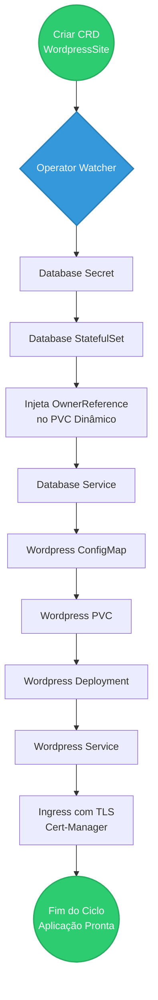

# 🚀 WordPress Operator for Kubernetes

Este repositório contém a implementação de um **Kubernetes Operator** desenvolvido do zero para gerenciar um site WordPress completo (Aplicação + Banco de Dados MySQL + Rede + Storage + Certificados TLS) de forma declarativa.

> **Desafio de Onboarding** proposto por [Fabrizio Malta Di Napoli](https://github.com/fmnapoli) e [Chris-Corinthians](https://github.com/christian-devops).

---

## 🏗️ Arquitetura e Fluxo de Reconciliação (Chain of Responsibility)

O Operator utiliza o padrão de design **Chain of Responsibility** (através da biblioteca `cloud104/reconciler/v2`). O fluxograma abaixo demonstra como o Operator reage à criação de um Custom Resource (`WordpressSite`) e encadeia a criação de cada componente no cluster, garantindo idempotência e segurança:



📋 Pré-requisitos
Antes de iniciar, certifique-se de ter instalado em sua máquina:

Go (v1.24+)

Docker

kubectl

Kind (para criação do cluster local)

🚀 1. Utilizando em Cluster Local (Desenvolvimento)\
Ideal para testes rápidos e desenvolvimento na sua própria máquina.

1. Suba o cluster local e baixe as dependências:

```Bash
kind create cluster
go mod tidy
```

2. Instale o CRD no cluster:

```Bash
make install
```

3. Inicie o Operator localmente (ficará escutando no terminal):

```Bash
make run
```

☁️ 2. Utilizando no Cluster "Francis" (Produção)\
Cenário para realizar o deploy definitivo do Operator como um Pod dentro de um cluster remoto, utilizando Ingress e Certificados TLS gerados automaticamente.

1. Aponte para o contexto do cluster remoto:

```Bash
kubectl config use-context francis
```

2. Faça o Build e publique a imagem no Container Registry:

```Bash
# Faça o login no Docker Hub
docker login

# Exporte sua imagem e faça o build/push
export IMG=rodrigomicrosiga/wordpress-operator:v1.0.1
make docker-build docker-push IMG=$IMG
```

2. Faça o Build e publique a imagem no Container Registry efêmero e anônimo (`ttl.sh`)

O grande "pulo do gato" é que você não precisa fazer `docker login` e não precisa criar conta.\
Você simplesmente faz o push, o cluster remoto faz o pull, e depois de um tempo a imagem se autodestrói, sem deixar lixo para trás.\
A "mágica" do tempo de vida útil fica direto na tag da imagem.\
Os formatos de tempo suportados são `minutos (m), horas (h) ou dias (d)`, com limite máximo de 24 horas.\
Como o registro é público, é bom usar um nome bem específico (ou até um `UUID`) para evitar que outra pessoa use o mesmo nome.

```Bash
# Gerar UUID
uuidgen

# Exemplo de retorno
c8a4aa2f-d279-4d10-9437-13d7cf9df030

# Exporte sua imagem e faça o build/push
export IMG=ttl.sh/c8a4aa2f-d279-4d10-9437-13d7cf9df030:2h
make docker-build docker-push IMG=$IMG
```

3. Faça o Deploy do Operator no cluster:

```Bash
make deploy IMG=$IMG
```

Valide se o Operator está rodando com: `kubectl get pods -n wordpress-operator-system`

♻️ 3. O Ciclo de Vida: Criar, Destruir e Recriar\
O gerenciamento de toda a infraestrutura é feito de forma declarativa através de um único manifesto YAML (teste.yaml).

🟢 Passo a Passo para Implementação (Criar)\
Ajuste o seu arquivo teste.yaml com as configurações de domínio (ex: meu-blog.francis.tcloud-devops.cloudtotvs.com.br), classe de Ingress e TLS.

Aplique no cluster:

```Bash
kubectl apply -f teste.yaml
```
Acompanhe a subida da infraestrutura e a geração do certificado:

```Bash
kubectl get pods,pvc,ingress -w
kubectl get certificate -w
```
Acesso: Assim que o certificado estiver `READY=True` e os pods `Running`, acesse a URL configurada no navegador. (Em ambiente local, use `kubectl port-forward svc/meu-blog 8080:80`).

🔴 Passo a Passo para Apagar Tudo (Terra Arrasada)\
Para realizar o teste do Garbage Collection e garantir que não fiquem recursos órfãos (incluindo discos dinâmicos do StatefulSet), basta deletar o recurso pai:

```Bash
kubectl delete -f teste.yaml
```
Validação: Garanta que a infraestrutura foi limpa verificando a ausência de recursos:

```Bash
kubectl get all,pvc,ingress,certificate
```
🔄 Passo a Passo para Recriar Tudo (Do Zero)\
Para testar a resiliência do Operator a partir de um estado limpo:

Certifique-se de que a aplicação foi destruída (passo anterior).

Reinicie o Operator para limpar qualquer cache local:

```Bash
kubectl delete pods --all -n wordpress-operator-system
```
Dispare a criação novamente:

```Bash
kubectl apply -f teste.yaml
```
Este diário documenta a jornada passo a passo, decisões arquiteturais e o troubleshooting enfrentado durante o desenvolvimento.

* [22/05 a 25/05/2026] - Planejamento e Estudos: Entendimento do escopo do desafio.

* [26/05/2026] - Passo 1: Setup Inicial e Fundação: Estruturação do repositório com Kubebuilder (`domain cloud104.io`). Instalação da biblioteca `cloud104/reconciler`.

* [26/05/2026] - Passo 2: O Contrato (API/CRD): Modelagem do estado desejado (`Spec/Status`) no `wordpresssite_types.go` com markers de validação. Resolução de conflitos de dependências via `go mod tidy`.

* [26/05/2026] - Passo 3: Factory Pattern: Separação da lógica de geração de manifestos puros (`corev1, appsv1, networkingv1`) da lógica de `reconciliação`.

* [26/05/2026 a 27/05/2026] - Passo 4: Implementação da Chain of Responsibility: Criação dos `Ensurers` isolados. Ajuste do retorno das funções para o tipo `ctrl.Result` exigido pelo pacote `controller-runtime`.

* [28/05/2026] - Passo 5: Workload Ensurers e Idempotência: Consolidação da infraestrutura. Uso de `controllerutil.CreateOrUpdate` para convergência de estado e proteção lógicas em campos imutáveis do K8s (ex: `VolumeClaimTemplates`).

* [28/05/2026] - Passo 6: Observabilidade e Garbage Collection: * Identificação de falha onde discos (`PVCs`) órfãos impediam a reconexão correta do banco ao deletar e recriar o `StatefulSet` (Erro: `Error establishing a database connection`).

  * Criação de lógica para injeção de OwnerReference diretamente nos PVCs gerados dinamicamente para garantir a exclusão em cascata.

* [01/06/2026 a 02/06/2026] - Implantação Multicluster: Preparação dos manifestos para operar tanto em ambiente local (`kind`) quanto no cluster remoto (`Francis`), incluindo geração de imagem `Docker` e roteamento via `nip.io`.

* [04/06/2026] - TLS e DNS com Cert-Manager:

  * Atualização do CRD para suportar a estrutura `TLSSpec`.

  * Refatoração do Factory e do `IngressEnsurer` para injetar anotações dinâmicas (`cert-manager.io/cluster-issuer`) de forma persistente.

  * Teste definitivo de Terra Arrasada validando a criação dinâmica de certificados Let's Encrypt com status `READY=True`.

## 🌟 Arquitetura e Maturidade SRE

Este operador foi empacotado focado em ambientes de produção, incluindo:
* **Helm Chart Nativo:** Toda a instalação é orquestrada via Helm, parametrizando recursos, restrições de segurança (SecurityContext) e afinidades.
* **RBAC Blindado:** A ServiceAccount possui acessos estritos (`Least Privilege`) apenas para manipulação dos workloads (Deployments, StatefulSets), rede e integração nativa com o **cert-manager** para provisionamento TLS.
* **Leader Election:** Preparado para Alta Disponibilidade. Múltiplas réplicas do controlador podem rodar simultaneamente, utilizando Leases (`coordination.k8s.io`) para eleição segura do líder e prevenção de concorrência de reconciliação.

## 🚀 Como usar

A definição do `WordPress` foi projetada para abstrair a complexidade da infraestrutura, permitindo instanciar novos ambientes de forma declarativa.

```yaml
apiVersion: wordpress.cloud104.io/v1alpha1
kind: WordPress
metadata:
  name: meu-blog
  namespace: default
spec:
  # Adicione aqui as especificações do seu CRD
  replicas: 1
```

## 🛠️ Instalação (Production Ready)

O deploy do operador é inteiramente gerenciado pelo Helm Chart oficial incluso no repositório.

```bash
# 1. Clone o repositório
git clone https://github.com/rodrigomicrosiga/wordpress-operator.git
cd wordpress-operator

# 2. Instale o Operador no cluster
helm upgrade --install wordpress-operator charts/wordpress-operator -n wordpress-operator-system --create-namespace
```
## 🌟 Arquitetura e Maturidade SRE

Este operador foi projetado para ambientes multitenant e entrega infraestrutura como código (IaC) de forma nativa:
* **Helm Chart Nativo:** Instalação parametrizada orquestrada via Helm, controlando recursos, restrições de segurança (SecurityContext) e implantação limpa sem conflitos de *ownership*.
* **RBAC Blindado:** A ServiceAccount possui acessos estritos (`Least Privilege`) limitados à manipulação de workloads (Deployments, StatefulSets), rede (Ingresses, Services), discos (PVCs) e integração nativa com o **cert-manager** (Certificates).
* **Leader Election:** Preparado para Alta Disponibilidade. Múltiplas réplicas do controlador podem rodar simultaneamente, utilizando Leases (`coordination.k8s.io`) para eleição segura do líder e prevenção de concorrência.
* **UX de Primeira Classe (K9s Ready):** Implementação de *Custom Columns* (`+kubebuilder:printcolumn`) para exibição em tempo real da saúde da instância (`Phase`) e da `URL` de acesso diretamente nas listagens do `kubectl` e k9s, com inteligência de protocolo (HTTP/HTTPS) baseada na configuração TLS.

## 🚀 Como usar

A definição do `WordpressSite` abstrai a complexidade da infraestrutura, permitindo instanciar novos ambientes, bancos de dados acoplados e certificados SSL com um único manifesto declarativo.

```yaml
apiVersion: wordpress.cloud104.io/v1alpha1
kind: WordpressSite
metadata:
  name: meu-blog
  namespace: default
spec:
  domain: meu-blog.empresa.com.br
  wordpress:
    image: wordpress:6.5-apache
    replicas: 1
    storageSize: 2Gi
  database:
    name: wordpressdb
    user: wpuser
    storageSize: 5Gi
  tls:
    enabled: true
    issuerName: letsencrypt-prod
    issuerKind: ClusterIssuer
```

## 🛠️ Instalação via Helm

O deploy do operador é inteiramente gerenciado pelo Helm Chart oficial incluso no repositório.

```bash
# 1. Clone o repositório
git clone https://github.com/rodrigomicrosiga/wordpress-operator.git
cd wordpress-operator

# 2. Instale o Operador no cluster (Namespace isolado)
helm upgrade --install wordpress-operator charts/wordpress-operator -n wordpress-operator-system --create-namespace
```

